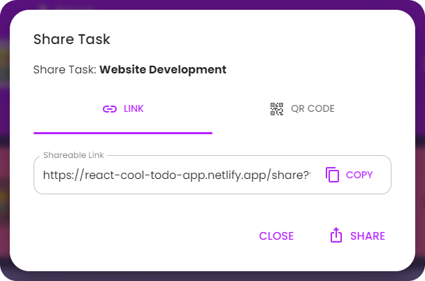
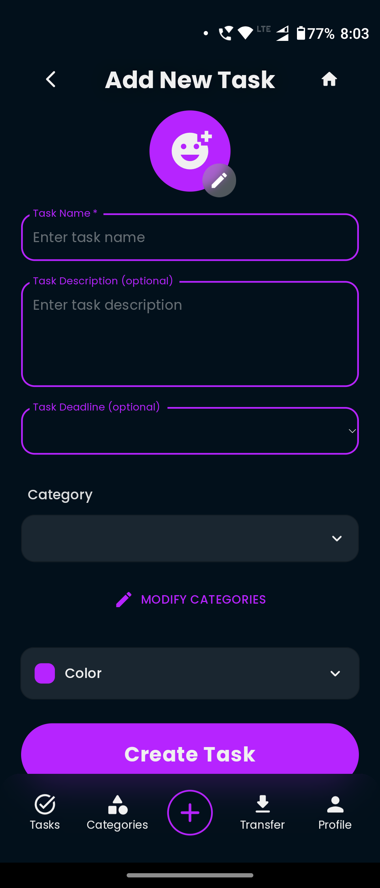
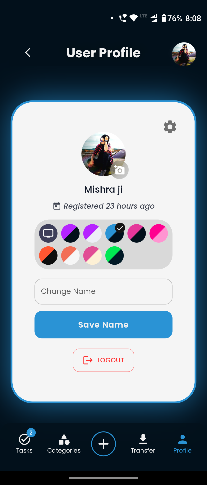

<!-- prettier-ignore -->

<h1>📝React.js To-do App</h1>

## [https://mrmishrasto-do.vercel.app/](https://mrmishrasto-do.vercel.app/)

## ⚡ Features

- **📦 Local and session storage**: Save tasks locally and retain form data using session storage.
- **😜 Custom Emojis**: The app features custom emojis and different emojis styles to choose from, including Apple, Facebook, Twitter, Google, and Native.
- **🔗 Share tasks by link**: Easily share your tasks with others using a link or QR code, with the option to download the QR code. [Example Link](https://mrmishrasto-do.vercel.app/share?task=%7B%22done%22%3Afalse%2C%22pinned%22%3Afalse%2C%22name%22%3A%22Web-Development%22%2C%22description%22%3A%22Creating%20a%20landing%20page%20for%20a%20website.%22%2C%22emoji%22%3A%221f4bb%22%2C%22color%22%3A%22%237ACCFA%22%2C%22date%22%3A%222024-04-06T15%3A21%3A47.955Z%22%2C%22deadline%22%3A%222024-04-08T15%3A21%3A00.000Z%22%2C%22category%22%3A%5B%7B%22id%22%3A%220292cba5-f6e2-41c4-b5a7-c59a0aaecfe3%22%2C%22name%22%3A%22Work%22%2C%22emoji%22%3A%221f3e2%22%2C%22color%22%3A%22%23248eff%22%7D%2C%7B%22id%22%3A%22afa0fdb4-f668-4d5a-9ad0-4e22d2b8e841%22%2C%22name%22%3A%22Education%22%2C%22emoji%22%3A%221f4da%22%2C%22color%22%3A%22%23ff8e24%22%7D%5D%7D&userName=Arpit%20Mishra) 
<!--   -->
- **📱 Clean and responsive design**: Ensures smooth user experience on various devices.
- **🌐 Native Intl Integration**: Adapts to your language, timezone, and date preferences using the native `Intl` API
- **🗂️ Customizable Categories**: Users can create and personalize task categories to suit their preferences.
- **🨠Color Themes**: Users can choose several app color themes.   
- **🗃️ Multi-Task Selection**: Option to select multiple tasks and perform actions on all of them at once.
- **🔎 Search Tasks**: Search functionality allows you to filter tasks by name or description, making it easy to find what you need.
- **🗣️ Task Reading Aloud**: Option to have tasks read aloud using the native `SpeechSynthesis` API, with a selection of voices to choose from.  
  
- **📥 Import/Export Tasks**: Users can import and export tasks to/from JSON files. This feature allows users to back up their tasks or transfer them to other devices easily. [Example Import File](https://github.com/arpitmiahra4/to-do-app/blob/main/example-import.json)
- **📴 Works offline**: This app is a Progressive Web App (PWA), which means it can be installed on your device, used even when you're offline and behave like a normal application with shortcuts and badges. 
  

## 📷 Screenshots

## 💻 Tech Stack

- React
- Typescript
- Vite
- Emotion
- MUI

## 👨‍💻 Installation

To install and run the project locally, follow these steps:

- Clone the repository: `git clone https://github.com/arpitmiahra4/to-do-app.git`
- Navigate to the project directory: `cd to-do-app`
- Install the dependencies: `npm install`
- Start the development server: `npm run dev`

The app will now be running at [http://localhost:5173/](http://localhost:5173/).
